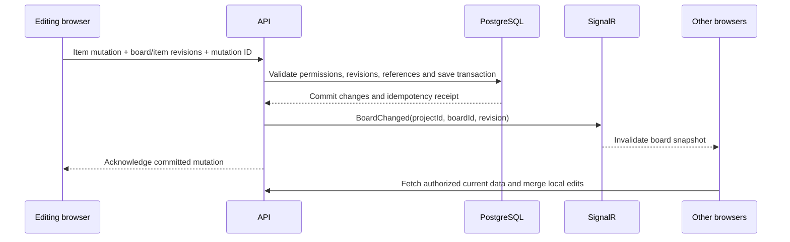

# Collaboration: recovery and scaling

## Current write path

Canvas writes commit directly to the database. The browser batches edits starting after 250 ms; the HTTP adapter spaces mutations by at least 1.1 seconds to respect the 60 mutations/minute/user limit. Item dragging is kept as frame-scheduled visual geometry and commits the final positions in one board update on release, so pointer movement does not enter the durable write queue. Each mutation contains changed items, not an entire replacement board. A transaction checks the board revision, each touched item revision, permissions and graph references. A persisted mutation ID makes retries of a lost response safe.

Successful canvas writes now publish a small SignalR invalidation after commit. Notification failure does not turn a committed write into an API error. Clients coalesce notifications with background reads. Polling remains a fallback for missed events, disconnected clients, and changes made through other endpoints (including comments, membership and trash). A notification is not authoritative data: the following HTTP request checks access again.

## Automatic recovery

Independent changes are merged against the last confirmed state. A rejected revision causes a fresh read and a bounded rebase/retry. Temporary network/gateway failures replay the identical mutation; throttled retries respect `Retry-After`.

If edits overlap, or contention repeatedly prevents a save, the browser stores a separate copy of its unsaved project view before adopting the shared snapshot. The UI explains the refresh and offers download/deletion of recovery copies. Copies are account-scoped and survive reloads; separate keys prevent tabs from overwriting each other's copies. They contain the board being edited, not a full multi-board project backup. Storage failure keeps the unsaved version on screen and retains the manual error controls. No full-page reload is needed.

Comment writes rebase unrelated board changes. Conflicting comment text is also preserved before refresh. Board switching cannot discard a blocked save. Only active editing presence locks an item; selection/inspection and read-only roles do not lock it. Presence is advisory and expires: database revision checks remain the final concurrency protection.

## Why a write queue is not the first fix

RabbitMQ can buffer bursts, but queueing conflicting edits does not determine which text should win. It adds worker lag, delivery retries and ordering requirements. A broker accepting a message is different from the database committing it. The UI would need to distinguish queued, committed and rejected changes. Every command would still need idempotency and revision checks.

Keep interactive writes synchronous until measurements show database write throughput is the bottleneck. RabbitMQ is more suitable for background exports, notifications, indexing and other work outside the interactive save path. If added, publish via a transactional outbox so database commit and event delivery cannot silently diverge.

## Next steps, in order

1. Measure 409 reasons, failed rebases, 429s, save latency, snapshot size and presence traffic with several clients editing the same board. The whole-board revision gate can reject independent item edits; do not equate these expected concurrency conflicts with database outages.
2. Add notifications to the remaining write endpoints and measure reducing polling frequency. Delta reads by revision and narrower invalidation can reduce full-board downloads on busy boards. Retain periodic reconciliation for missing/out-of-order events.
3. Evaluate accepting independent item writes against stale board revisions, retaining per-item checks, graph validation and transactional protection. This needs concurrent transaction tests, especially for parent/frame deletion and links.
4. For multiple API instances, use a SignalR Redis backplane (or Azure SignalR) **and** distributed presence/lease storage. A backplane alone does not distribute the in-memory `PresenceRegistry`. The current deployment should be treated as a single presence instance.
5. If multiple people must edit the same rich-text document simultaneously, evaluate a CRDT/OT editor. Snapshot merging deliberately does not try to combine overlapping text edits automatically.

No broker or database migration is required by this change. Capacity claims require load testing; the regression tests establish behavior, not a maximum supported number of collaborators.

References: [SignalR Redis backplane](https://learn.microsoft.com/en-us/aspnet/core/signalr/redis-backplane?view=aspnetcore-10.0), [RabbitMQ acknowledgements and publisher confirms](https://www.rabbitmq.com/docs/confirms), [RabbitMQ reliability](https://www.rabbitmq.com/docs/reliability).
